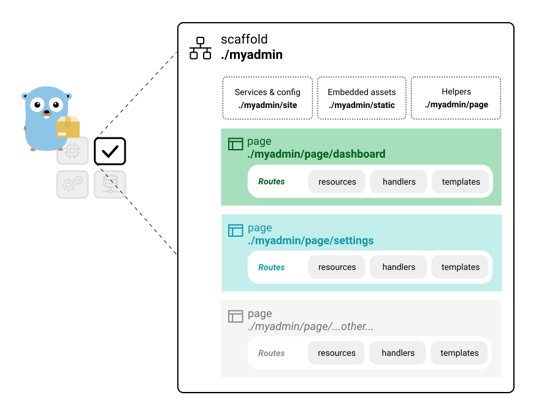

# Scaffold Overview

Intro page for the `github.com/rur/good/baseline/starter_test` site

### The web app that's just another Go package



A few things to know before diving into the code...

## Site

Code in the scaffold package `./baseline/starter_test` is yours to modify as you please. The other Good CLI commands can help you with pages and routing if you keep the general _./page/..._ structure.

### Read the code

The code is generally self documenting. After a quick read through, you should have a sense of where to modify things to suit your needs.

Markdown guideline documents can be found in the __./docs__ directory of your scaffold.

### Code generation CLI overview:

1. `good scaffold`: Create the initial setup
2. `good page`: Add a new page
3. `good routes gen`: Update routes for a page


## Pages

Top-level sections are organized into pages, each with it's own routing config for page endpoints.

Pages are independent by default; refactor to control redundancy as your site grows.

### Resources:

* A `site.Env` singleton is initialized during startup and passed to handlers.
* Each page has a private `resources{}` struct for request-scoped data.
* The `[scaffold]/page` package is the destination for shared templates and request helpers.

Dependencies are passed to handlers using straightforward, type-safe function closures.

## Routes

Routing is configured with a TOML file in each page directory.

### Route Map

The `routemap.toml` config file outlines the layout hierarchy for a page and map: paths, templates and handlers to HTTP endpoints.

The `page/*/routes.go` files are generated with the plumbing code for page endpoints. This must be updated when
the route map changes.

__gen.go__ files appear in the appropriate places so that a recursive generate command will take care of code-gen tasks.

```
$ go generate ./baseline/starter_test/...
```

---

### 📈 next step, add a page

```
$ good page ./baseline/starter_test mydemo \
    --starter :bootstrap5/examples
$ go generate ./baseline/starter_test/...
$ go run ./baseline/starter_test --dev --port 8000
```

Then visit http://localhost:8000/mydemo

This command will create a page using the built-in bootstrap5 starter layout. This includes example functionality to show how to get things done. Choose a page name with lowercase alpha characters only.

#### Other layout starter options

You can try one of these other built-in starter options, if you wish:

| starter key             | description                    |
|-------------------------|--------------------------------|
| `:basic`                |	No layout, just a simple page scaffold (default)
| `:bootstrap5/layout`    |	Useful Bootsrap v5.0 web console layout
| `:bootstrap5/examples`  |	Working demos with the Bootsrap v5.0 layout and components
| `:bootstrap5/login`     |	Working user login and registration flow (in-mem mock dB)
| `:bootstrap5/datatable` |	TODO!
| `:minimum`              | Most bare bones option
| `:intro`                | Introduction page to the good scaffold


### 💡 tip, delete this page

This is the default home page created by the scaffold command. At some point, you'll want to delete it and use your own landing page. The following command will delete this page and update the scaffold...

```
$ good pages delete ./baseline/starter_test/page/intro
```

Tip: Use the `-h` CLI flag for more details on commands & options.

